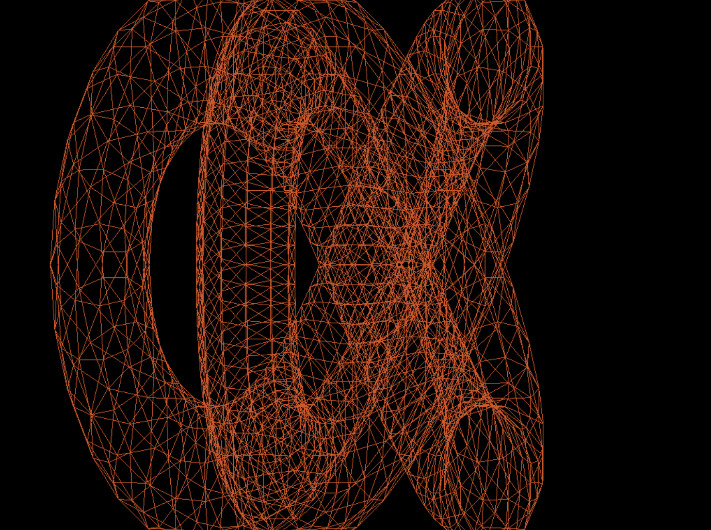
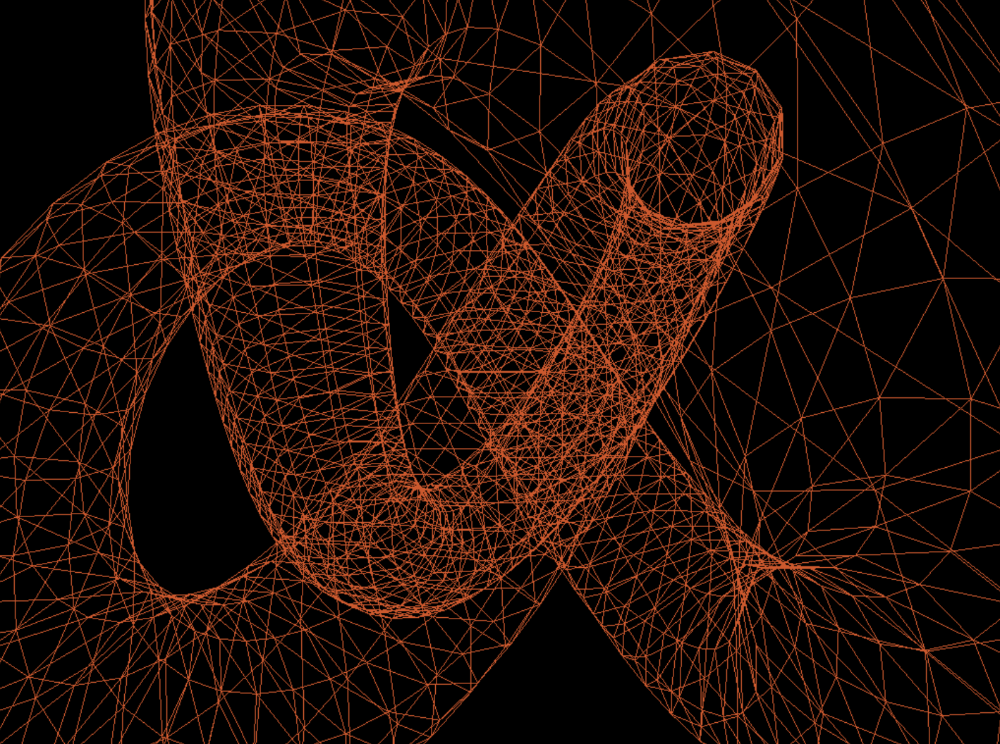
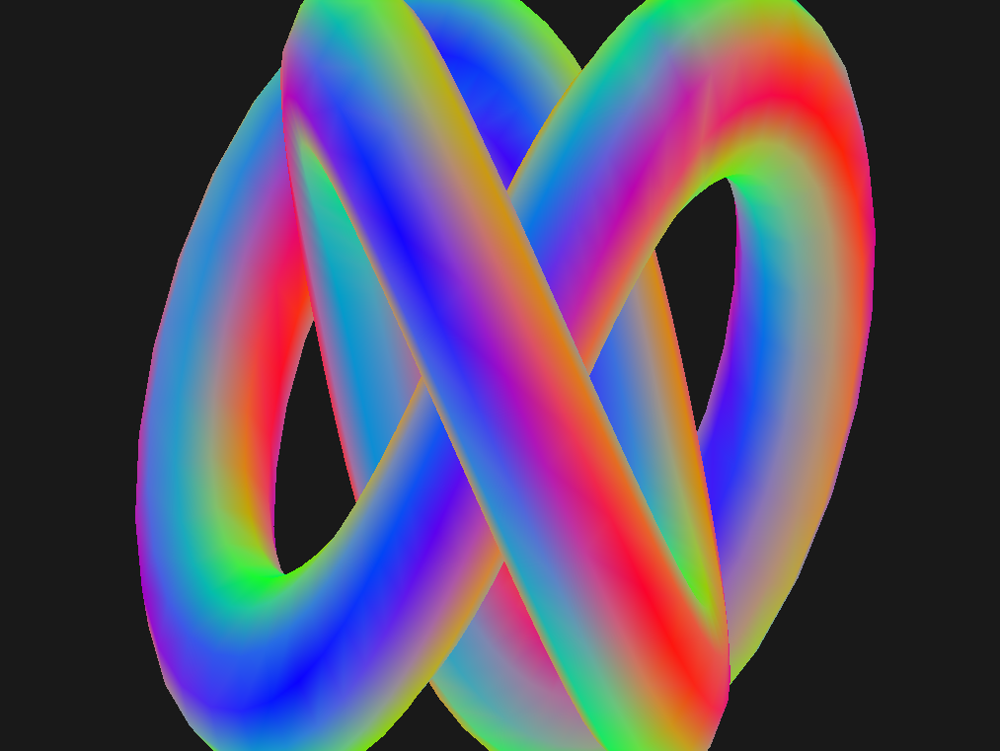
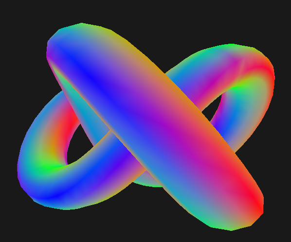
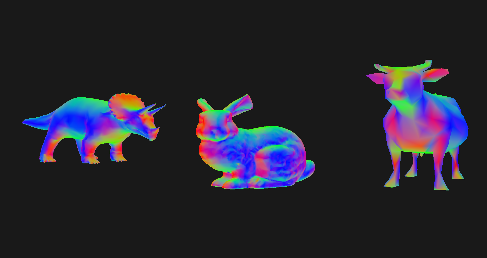

### Transformations and Scene Rendering

This program:
- Renders triangle meshes using OpenGL. 
- Implements custom translation, rotation and scaling functions and leverages them to apply the transformation from world to camera coordinates.
- Impements interactive translation and rotation of the camera using keyboard keys
- Implements perspective and parallel projection
 

    <figure>
  
  <figcaption>Parallel Projection</figcaption>
    </figure>
    <figure>
  
    <figcaption>Perspective Projection</figcaption>
      </figure>

  <figure style="text-align: center; position: relative;">
    
    <figcaption style="position: absolute; bottom: 0; width: 100%;">Parallel Projection</figcaption>
  </figure>
  <figure style="text-align: center; position: relative;">
    
    <figcaption style="position: absolute; bottom: 0; width: 100%;">Perspective Projection</figcaption>
  </figure>

- Calculates and stores vertex normals for all triangle meshes and renders them as if they were RGB colours over the surfaces of the meshes.

    <figure>
  
  <figcaption>Parallel Projection</figcaption>
    </figure>
    <figure>
  
    <figcaption>Perspective Projection</figcaption>
      </figure>

- Implements scene composition, i.e., the possibility to render multiple models, with custom parameters for scaling, rotation, and translation

    <figure>
  
  <figcaption>Scene Composition</figcaption>
    </figure>

