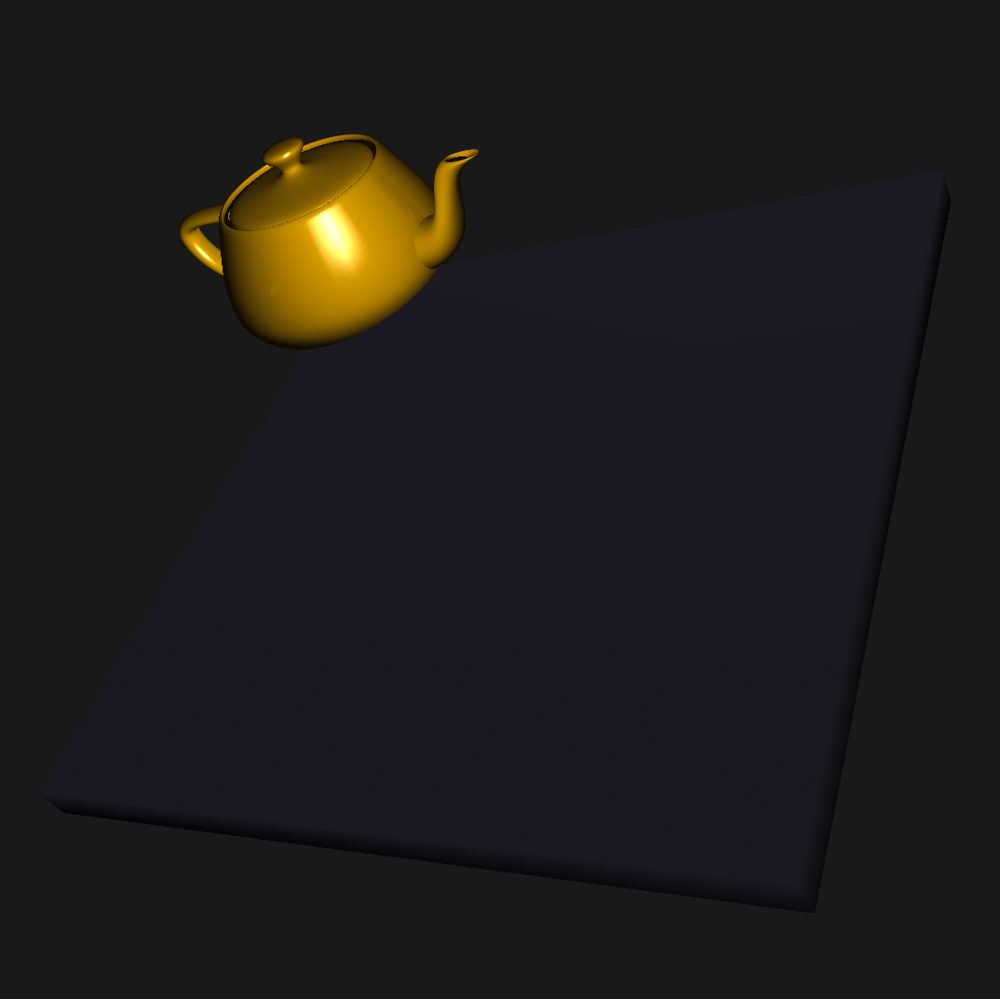
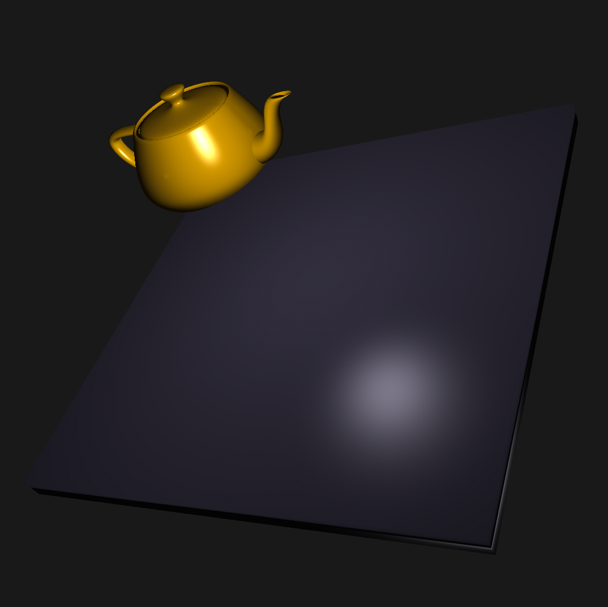
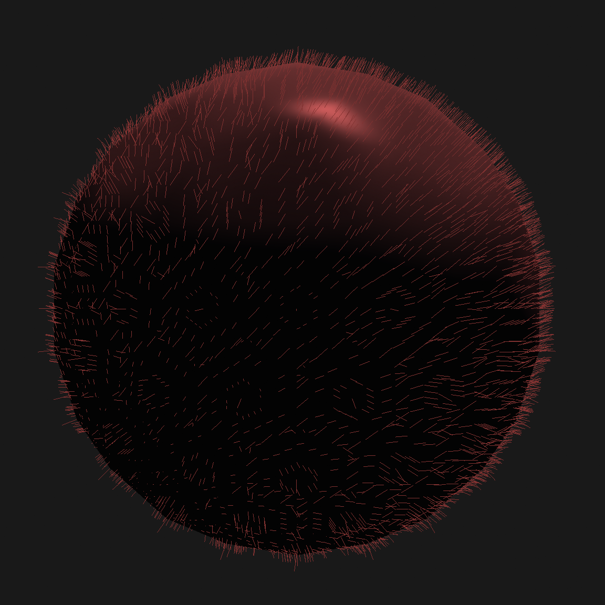

## Shader programming

Highlights:
- Implements a shader program that uses the Phong Reflection Model to find the light intensity at polygon vertices, and then uses Gouraud shading over the triangle surfaces.

- Implements a shader program that accomplishes Phong Shading, i.e., vertex normals are interpolated over the faces. In this way, the Phong Reflection Model can be used for each pixel. 
- Shown below, a comparison of the result from Phong and Gouraud shading; note the nice looking specular highlights which can appear also on large polygons.  

| Gouraud Shading | Phong Shading |
|---------------------|---------------------|
|  |  |
- Shader programs can be set by the user, interactively (i.e. during runtime).
- Implements a shader program that uses the geometry shader to add additional lines coming out of each surface, making a rudimentary rendering of fur. It is then used together with one of the previous shaders to do a two-pass rendering of a furry model.

| Geometry Fur Shading  |
|---------------------|
|  |  |

